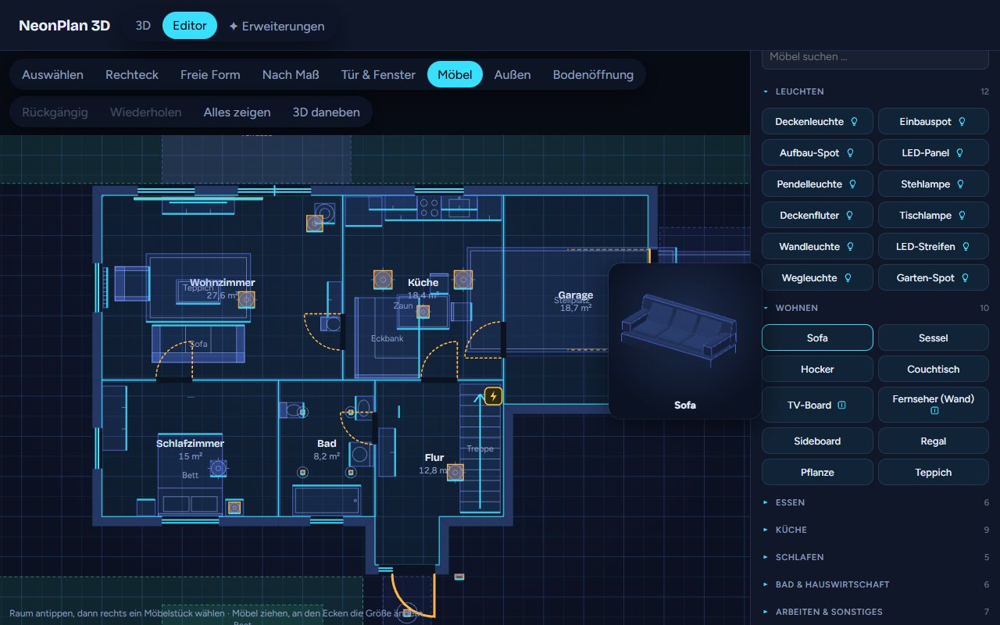
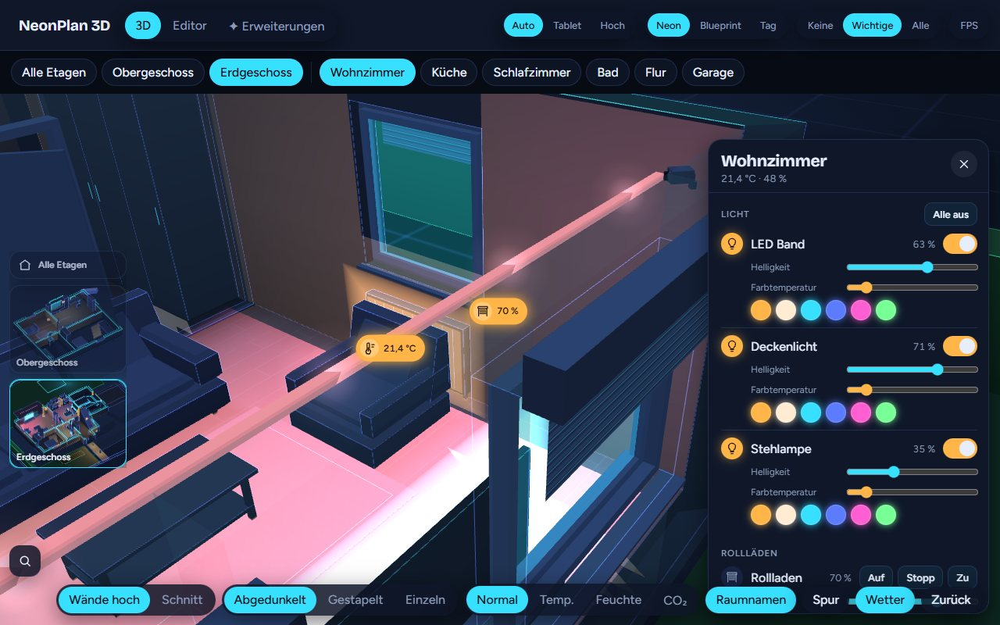
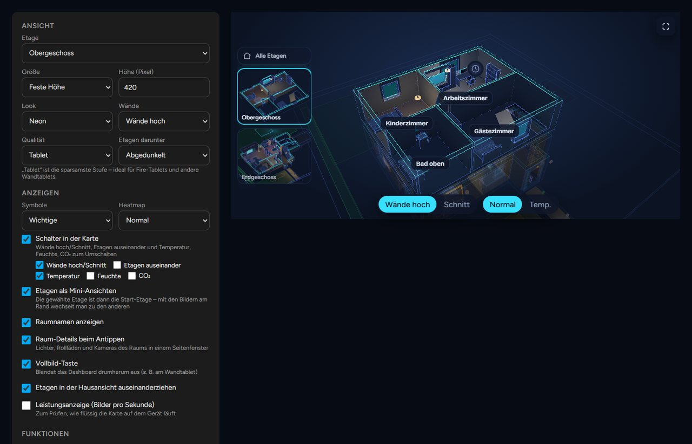

# NeonPlan 3D

[](https://www.paypal.com/donate/?hosted_button_id=Z3G2VWKSK5VJL)

**by Mastershort** – draw your home right inside Home Assistant and control it in a neon 3D view: lights glow in their colours, blinds move, doors and windows open, cameras watch, and the TV shows what is playing. No external tools, no cloud, made for wall tablets.

▶️ **[Try the online demo](https://neonplan3d.mastershort.de/)** – right in your browser, with invented demo data: turn the house, switch lights, open the editor. Nothing to install.

[](https://my.home-assistant.io/redirect/hacs_repository/?owner=Mastershort&repository=neonplan3d&category=integration)

[](https://neonplan3d.mastershort.de/)

📖 **Manual:** [English](https://mastershort.de/en/neonplan3d/manual/?lang=en) · [Deutsch](https://mastershort.de/neonplan3d/anleitung/?lang=de) (also in this repository: [manual.md](docs/manual.md), [anleitung.md](docs/anleitung.md))

## What it does

| | |
|---|---|
|  | **Plan editor in Home Assistant** – floors, rooms as rectangles or free shapes, automatic walls and free-standing partitions, doors, windows, garage doors, stairs and floor openings, outdoor areas and a roof. The 3D view runs next to the plan while you draw. |
|  | **Live 3D view** – tap a lamp to switch it, swipe to dim, long press for colours; blinds follow their position, windows tilt and open, doors swing. A room panel lists everything of the room's area. |
|  | **Furniture and lamps** – 40 built-in models plus furniture packs. Lamps light their room in their own colour, TVs, washing machines and radiators glow while they run. |
|  | **Cameras** – mounted on walls or ceilings with their field of view on the floor, red while they see motion; a tap shows the snapshot. |
|  | **Wall tablet ready** – warnings for smoke, gas, water, alarm and windows open in the rain, a kiosk mode with idle return and night dimming, scene buttons, and a *Tablet* quality level for Fire tablets. |
|  | **Dashboard card** – `custom:neonplan3d-card` with a visual editor, loaded automatically. |

Also included: parking spots with vehicles that appear while a car is home, a heatmap for temperature, humidity and CO₂, sunlight through the windows from `sun.sun`, three looks (*Neon*, *Blueprint*, *Day*), a search, restore points, and a full backup of plan, pictures and packs.

### Free, packs and Pro add-ons

The integration and everything above are free and open source (MIT). Optional extras are sold at [mastershort.de](https://mastershort.de/en/neonplan3d/?lang=en) and install from the **Extensions** tab:

- **Furniture packs** – rooms (living, kitchen, bedroom, bath), areas (kids, office, garden, garage, fitness, smart home), vehicles, stairs & railings.
- **Pro add-ons** – *Camera cockpit* (look through a camera, motion trail), *Weather outside* (rain, snow, clouds, lightning, sun and moon), *Live screens* (app colours and artwork on TVs, pictures by rules, camera live pictures on screens).

Bought packs are signed for your installation and update by themselves once a day. Everything installed keeps working without the shop.

## Installation

### HACS

[](https://my.home-assistant.io/redirect/hacs_repository/?owner=Mastershort&repository=neonplan3d&category=integration)

1. Click the button above, or in HACS: ⋮ → *Custom repositories* → add `https://github.com/Mastershort/neonplan3d` as **Integration**.
2. Install **NeonPlan 3D** and restart Home Assistant.
3. Add the integration:

   [](https://my.home-assistant.io/redirect/config_flow_start/?domain=neonplan3d)

   or *Settings → Devices & services → Add integration → NeonPlan 3D*.
4. Open **NeonPlan 3D** in the sidebar, switch to **Editor** and draw your first floor.

### Manual

Copy `custom_components/neonplan3d` into `config/custom_components/` and restart Home Assistant.

Requires Home Assistant 2025.1 or newer.

## Dashboard card

All options can be set in the card's visual editor; in YAML:

```yaml
type: custom:neonplan3d-card
floor: floor_ab12cd34   # optional: show a single floor (id from the editor)
height: 420             # optional: height in pixels
fill: false             # optional: fill the screen below the dashboard header instead of a height
walls: auto             # optional: auto | cut
explode: true           # optional: pull floors apart in the house view
floor_stack: dim        # optional: floors below an opened floor: dim | stacked | single
quality: auto           # optional: auto | low | high
theme: neon             # optional: neon | blueprint | day
markers: important      # optional: none | important | all
heatmap: none           # optional: none | temperature | humidity | co2
room_panel: true        # optional: tapping a room opens its details
room_names: true        # optional: room names in 3D
controls: true          # optional: switches in the card, or a list of walls, floors, temperature, humidity, co2
floor_thumbs: true      # optional: floor pictures to switch floors
fullscreen_button: false
stats: false            # optional: performance display
alerts: true            # optional: smoke, gas, CO, water, alarm and windows open in the rain pulse
alert_jump: false       # optional: jump to the room of a new warning
scenes: true            # optional: scene and script buttons of the selected room
motion_trail: false     # optional: motion of the last 30 minutes (Pro: camera cockpit)
weather: true           # optional: weather outside (Pro: weather)
weather_entity: weather.home   # optional: which weather entity (default: as set in the plan)
idle_return: 0          # optional: kiosk – seconds without a touch until the start view returns
night: "off"            # optional: kiosk – dim at night: off | sun | "22:00-06:00"
idle_orbit: false       # optional: kiosk – slow camera turn after the idle return
```

## Privacy

NeonPlan 3D stores the plan, its pictures and the packs in Home Assistant's `.storage`. It talks to the internet only when you enter a licence key in **Extensions**: then it asks mastershort.de once a day for updates of your packs, sending the key and an anonymous installation fingerprint (a hash).

## Development

```bash
cd frontend
npm install
npm test            # pure logic
npm run typecheck
npm run build       # writes the bundles to custom_components/neonplan3d/frontend (committed)
npm run screenshot  # renders preview/index.html (invented demo data) with a local Chrome or Edge
```

- **Preview without Home Assistant**: open `preview/index.html` through any local web server.
- **Deploy to a test instance**: create `deploy.local.json` with `{"target": "<config>/custom_components/neonplan3d"}` and run `npm run deploy` in `frontend/`.
- **Python tests** run in CI with `pytest-homeassistant-custom-component`.
- **Furniture pack format**: [docs/packs.md](docs/packs.md) (German).

## Ideas, questions and bugs

- **Ideas and voting:** [Discussions → Ideas](https://github.com/Mastershort/neonplan3d/discussions/categories/ideas) – vote with 👍 on what you want most.
- **Questions:** [Discussions → Q&A](https://github.com/Mastershort/neonplan3d/discussions/categories/q-a).
- **Bugs:** [open an issue](https://github.com/Mastershort/neonplan3d/issues/new/choose).
- **What changed:** [CHANGELOG](CHANGELOG.md).

## Licence

MIT – see [LICENSE](LICENSE). Furniture packs and Pro add-ons sold in the shop are not part of this repository.

## Unterstützen / Support

NeonPlan 3D ist kostenlos. Wenn es dir gefällt, freue ich mich über einen Kaffee ☕ –
oder schau dir die Möbel-Packs im Shop an: https://mastershort.de/neonplan3d/
NeonPlan 3D is free. If you like it, you can buy me a coffee or check out the furniture packs.

[](https://www.paypal.com/donate/?hosted_button_id=Z3G2VWKSK5VJL)
