# NeonPlan 3D – Manual

🇬🇧 English · [🇩🇪 Deutsch](anleitung.md)

NeonPlan 3D draws your home right inside Home Assistant and shows it as a 3D model in a neon look. Lights glow in their colours, blinds move, windows tilt, doors swing open, cameras look into the room and the TV shows what is playing. Everything runs locally in Home Assistant, without a cloud or external programs, and it is built for wall tablets.

This manual describes every feature of version 1.0. The pictures come from the demo with invented data. The app follows the language of your Home Assistant user; the labels below are the English ones.

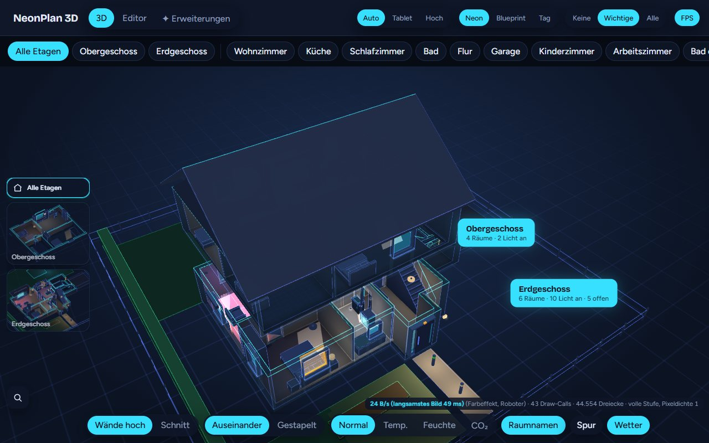

---

## Contents

1. [Installation](#1-installation)
2. [Your first 3D plan in ten minutes](#2-your-first-3d-plan-in-ten-minutes)
3. [The interface at a glance](#3-the-interface-at-a-glance)
4. [The editor](#4-the-editor)
5. [The 3D view](#5-the-3d-view)
6. [Pro add-ons](#6-pro-add-ons)
7. [Extensions, shop and furniture packs](#7-extensions-shop-and-furniture-packs)
8. [The dashboard card](#8-the-dashboard-card)
9. [NeonPlan 3D on a wall tablet](#9-neonplan-3d-on-a-wall-tablet)
10. [Backup and moving](#10-backup-and-moving)
11. [Data and privacy](#11-data-and-privacy)
12. [FAQ and troubleshooting](#12-faq-and-troubleshooting)

---

## 1. Installation

### Requirements

- Home Assistant 2025.1 or newer.
- A browser with WebGL. That is every current browser, the Home Assistant app and Amazon Fire tablets.
- An administrator to edit. All other users see and control the plan but do not change it.

### With HACS

[](https://my.home-assistant.io/redirect/hacs_repository/?owner=Mastershort&repository=neonplan3d&category=integration)

The button opens NeonPlan 3D straight in the HACS of your installation. By hand:

1. Open **HACS** in Home Assistant.
2. Choose **⋮ → Custom repositories** at the top right.
3. Enter `https://github.com/Mastershort/neonplan3d`, type **Integration**, and add it.
4. Search for **NeonPlan 3D**, install it and restart Home Assistant.
5. **Settings → Devices & services → Add integration → NeonPlan 3D**, or straight with this button:

   [](https://my.home-assistant.io/redirect/config_flow_start/?domain=neonplan3d)

**NeonPlan 3D** now appears in the sidebar. The dashboard card is available right away, no resource needed.

### By hand

Copy the folder `custom_components/neonplan3d` from the repository into `config/custom_components/`, restart Home Assistant and add the integration as above.

### Updates

HACS reports new versions by itself. Restart Home Assistant after every update. Until then NeonPlan 3D shows a note at the top that a restart is pending. Your plan always stays, even if you remove the integration and add it again.

---

## 2. Your first 3D plan in ten minutes

1. Open **NeonPlan 3D** in the sidebar and switch to **Editor** at the top.
2. Choose **Add floor** on the right. If you have floors in Home Assistant, NeonPlan 3D offers them directly.
3. If the floor has areas, **"Add … rooms from HA areas"** creates a room for each area. Drag the rooms into place and adjust the corners. Or draw with **Rectangle** or **Free shape**.
4. Tap a wall with **Doors & windows** to add doors and windows.
5. Tap a room and choose **Place all automatically** under **Devices** on the right. The lights, covers, thermostats, media players and sensors of the area now stand in the room.
6. Furnish the room with **Furniture** and **Furnish …**.
7. Switch to **3D** at the top. Done: tap a lamp, and it switches.

The plan saves itself while you edit.

---

## 3. The interface at a glance

There are three tabs at the top:

| Tab | What for | Who sees it |
|---|---|---|
| **3D** | Look at the house and control it | everyone |
| **Editor** | Draw the floor plan, place furniture and devices | administrators |
| **✦ Extensions** | Shop connection, Pro add-ons, furniture packs | administrators |

The dashboard card brings the same 3D view into any dashboard. See [chapter 8](#8-the-dashboard-card).

---

## 4. The editor


The editor has the floor plan in the middle, the toolbar at the top and the sidebar on the right. The sidebar always shows what is selected: the floor, a room, an item, a door or a device.

### 4.1 Tools

| Tool | What it does |
|---|---|
| **Select** | Tap rooms, furniture, doors, windows and devices, move them, drag corners |
| **Rectangle** | Draw a rectangular room |
| **Free shape** | Draw a room corner by corner |
| **Wall** | Draw a single free-standing wall, e.g. a partition |
| **Doors & windows** | Tap a wall to add an opening |
| **Furniture** | Open the furniture library |
| **Outdoor** | Draw outdoor areas such as lawn, terrace or pool |
| **Floor opening** | Draw a hole into the floor, e.g. above the staircase |

Next to them are **Undo**, **Redo**, **Show all** and **3D beside**. A short hint for the active tool is always shown at the bottom of the plan.

**Mouse and touch:** Two fingers pan and zoom. With a mouse, the wheel zooms and dragging an empty spot pans. **Ctrl+Z** undoes, **Ctrl+Y** or **Ctrl+Shift+Z** redoes, **Del** deletes the selection, **Esc** cancels. The **arrow keys** nudge the selection (room, corner, furniture, device, wall, outdoor area) by one grid step, with **Shift** by 10 cm, with **Alt** by 1 cm; doors and windows slide along their wall.

### 4.2 Floors

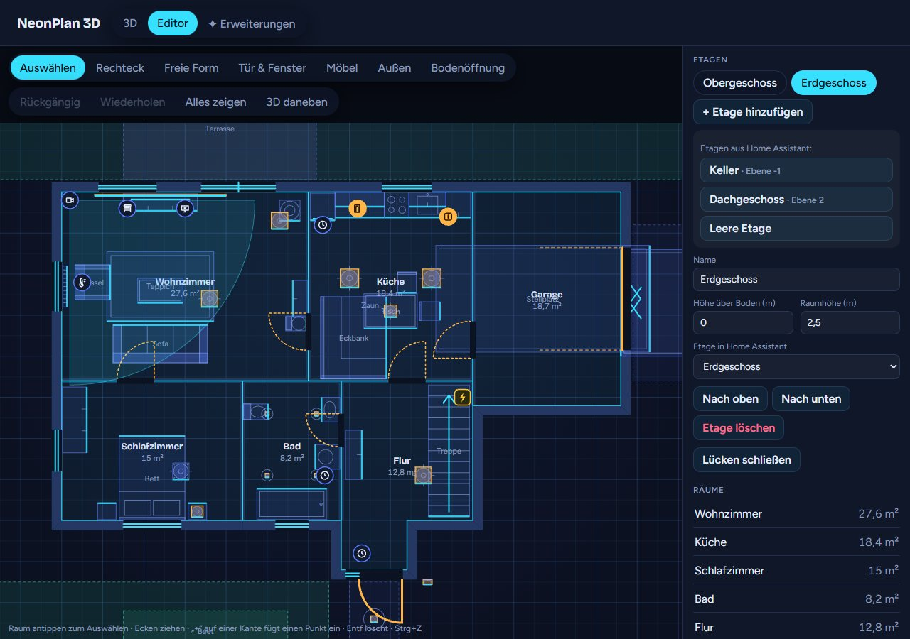

Without a selection, the sidebar shows the floors:

- **Add floor** creates a floor. Home Assistant floors that are still missing are offered.
- **Name**, **height above the ground** and **ceiling height** set where the floor sits in the 3D house and how tall its walls are.
- **Floor in Home Assistant** links the floor to an HA floor. Then **"Add … rooms from HA areas"** offers the areas of that floor as rooms.
- **Move up** and **Move down** change the order, **Delete floor** removes it with its rooms.
- **Close gaps** joins rooms that are up to 60 cm apart. This helps when you measured inside dimensions. The gap becomes the interior wall thickness.

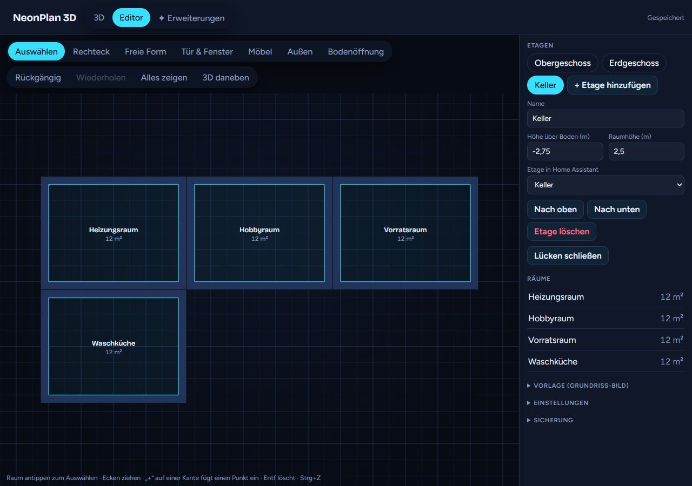

### 4.3 Drawing rooms

- **Rectangle:** Tap the plan and drag.
- **Free shape:** Set corner after corner. A tap on the first corner or **Enter** closes the room, **Esc** cancels.
- **Moving corners:** Tap a room with **Select** and drag its corners. The **+** on an edge inserts a corner.
- **Snapping:** Corners snap to the grid, to corners and edges of other rooms and to alignments. Hold **Alt** to move freely.

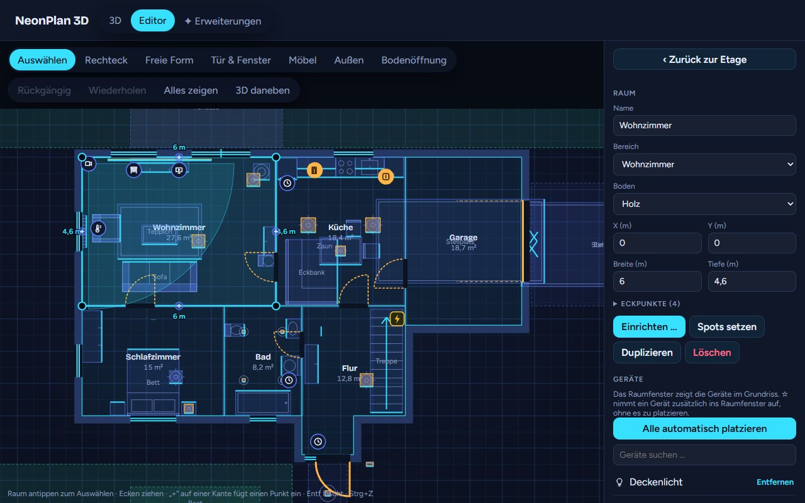

A selected room shows on the right:

- **Name** and **Area**: The link to a Home Assistant area matters most. Through it NeonPlan 3D finds the room's lights, covers, sensors and scenes.
- **Floor**: wood, oak, tiles, carpet, stone or concrete show as a subtle pattern in 3D.
- The **Devices** of the area, see [4.10](#410-devices).
- **Furnish …** for ready-made furniture sets, see [4.9](#49-furnishing-rooms).
- **Duplicate** and **Delete**.

### 4.4 Walls

Walls are created automatically: every shared edge of two rooms becomes an interior wall, every outer edge an exterior wall. Corners and T-junctions are mitred. You set the thicknesses under **Settings**.

**Single walls:** The **Wall** tool draws a free-standing wall, e.g. a partition that runs through half a room. **Shift** keeps it straight, **Alt** draws without snapping. Where it meets a room wall, the corner is mitred. When selected, drag the handles to move its ends or the line to move the whole wall. On the right you set **Length**, **Wall thickness** and **Height**. In 3D it behaves like any interior wall. You can put doors and windows into single walls too, with **Doors & windows** (see 4.7). Deleting the wall removes its doors and windows as well.

**Wall height:** Any wall can be lower than the room, e.g. a parapet or a counter. For a single wall you set its **Height** in the form. For rooms (rectangle and free shape) select the room; the form shows the **Wall heights** box with every wall of the room, named by its corners (e.g. "Wall 2–3", the numbers are shown at the corners in the plan) and with its length. Hovering a row or tapping its field lights the wall up in the plan. ↥ resets it to full room height. If two rooms share the wall, the lower setting applies. Windows and doors in a low wall end at the wall height. Low walls look lighter in the plan.

### 4.5 Settings

**Settings** unfolds at the bottom of the sidebar:

| Setting | Meaning |
|---|---|
| **Exterior wall (m)**, **Interior wall (m)** | Wall thicknesses |
| **Grid (m)** | Drawing step |
| **North** | Degrees clockwise from up. Needed for sunlight |
| **Roof** | No roof, flat roof or gable roof, with pitch and overhang |
| **Weather entity** | Which weather entity drives the weather outside, see [6.2](#62-weather-outside) |
| **Weather effects in 3D** | Which effects are shown |

### 4.6 Floor plan image as a template

Under **Template (floor plan image)** you load a photo or scan of your floor plan under the drawing. **Width in plan (m)** brings it to scale, **Opacity** makes it subtler. Then simply trace the rooms.

### 4.7 Doors, windows and garage doors

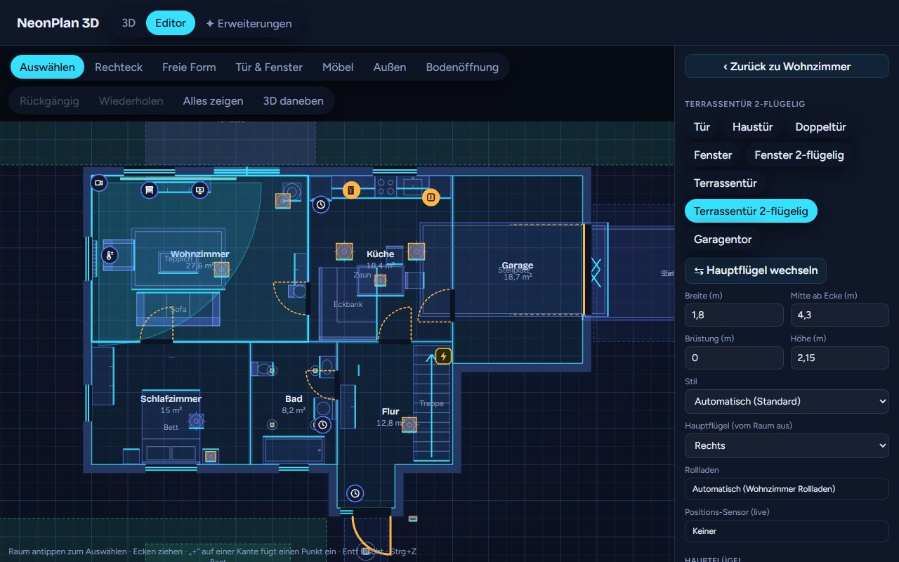

With **Doors & windows** you tap a wall, a room wall or a single wall. Then you choose the **Type** on the right: door, window or garage door. A window with a sill of 0 is a terrace door.

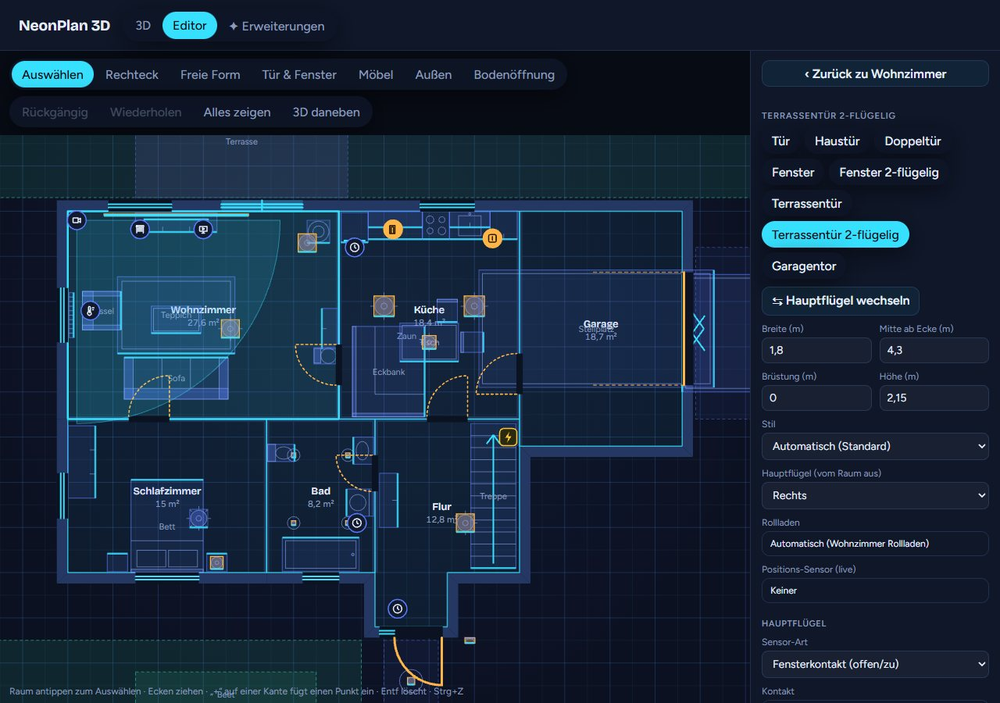

Every opening has:

- **Width**, **sill** and **height**, plus the hinge side. With **Select** you slide it along the wall.
- **Style:** room door, front door, front door with glass, with one or two sidelights, glass door, sliding door or **Opening (no door)**. An opening is just a gap in the wall, without frame and leaf; light always passes through. Windows come as standard or with glazing bars. "Automatic" picks a front door for exterior doors.
- **Leaves:** single or double, with an own contact for the second leaf.

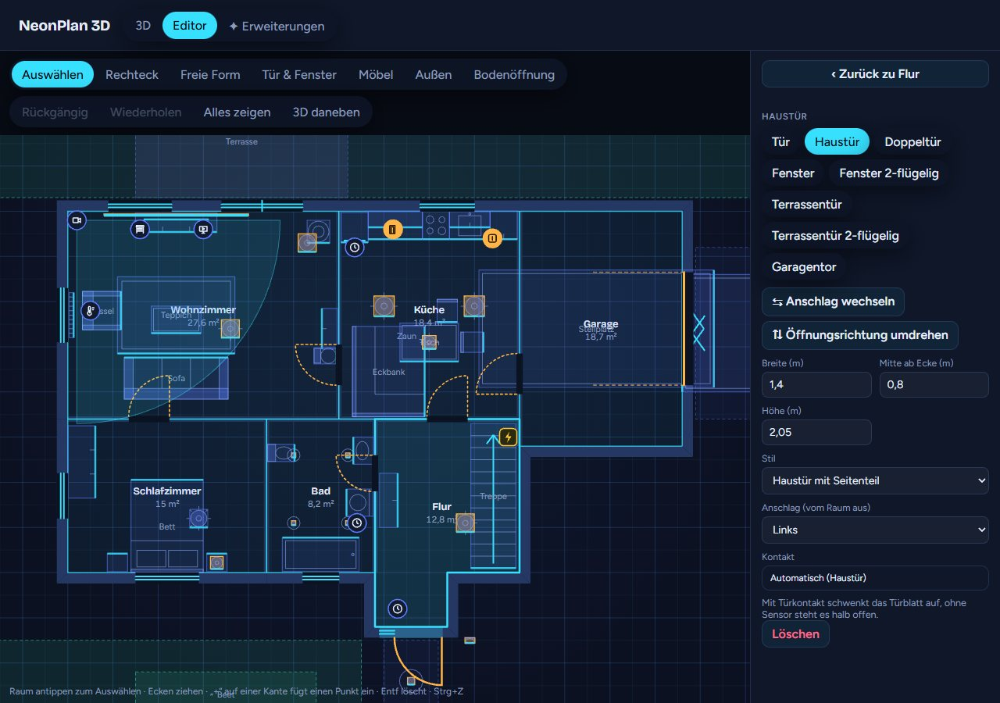

**Sensors:**

| Field | Effect in 3D |
|---|---|
| **Cover** | The blind moves in front of the window with the cover's position |
| **Position sensor** | For blinds whose position comes from a separate sensor, e.g. Homematic. Can be inverted |
| **Contact** | The door swings open, the window opens |
| **Tilt contact** | A second sensor that reports "tilted" |
| **Contact second leaf** | For double windows and doors |
| **Garage door** | A garage door follows a cover entity or a contact. Its open part lies under the ceiling |

NeonPlan 3D matches covers and contacts through the area automatically. You can change them by hand at any time.

### 4.8 Furniture


The **Furniture** tool opens the library with 40 built-in models in the sections Lights, Living, Dining, Kitchen, Sleeping, Bath & laundry and Work & other. Your installed furniture packs follow below. The search field filters all sections, sections fold open and closed. Hover over an entry for a small 3D preview.

**Symbols on the entries:**

- 💡 A **lamp**: it links to a light and switches in 3D.
- ⚡ An **electric item**: it takes an entity and a power sensor, e.g. a TV, a washing machine or a thermostat.

**Placing and editing:**

- Tap a room, then pick an entry. The item appears in the room.
- **Drag** to move it. Near a wall it turns its back to the wall and sits flush. **Alt** moves freely.
- The **handle in front of the item** turns it in 15° steps, the **corners** resize it.
- On the right you set width, depth, height, rotation and **Height above the floor**. That is how a network cabinet or a shelf hangs on the wall. **Automatic height** resets it.
- **Duplicate** and **Delete** are there too.

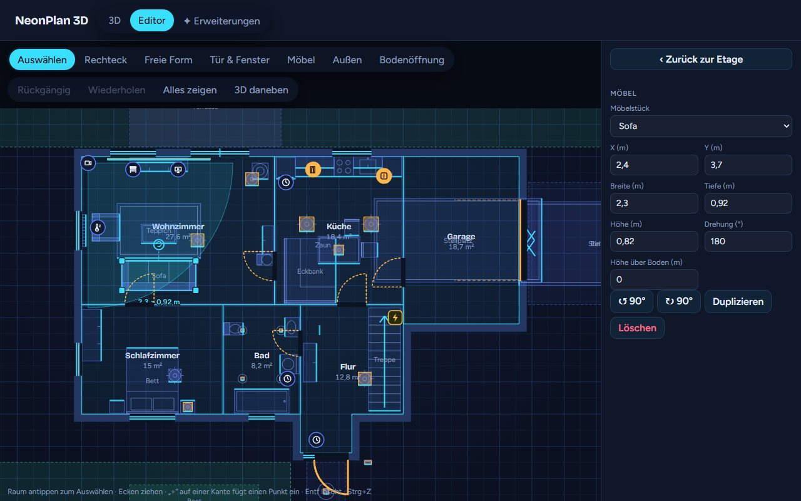

### 4.9 Furnishing rooms

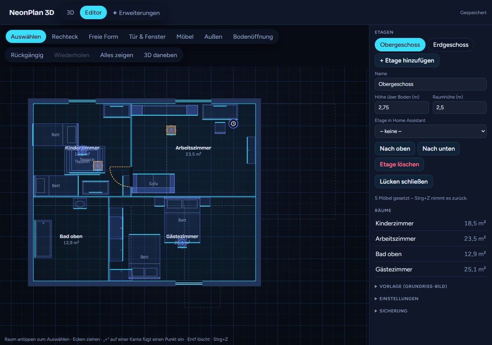

**Furnish …** on a room puts a whole set of furniture against the walls: kitchen row, L-shaped kitchen, bathroom, bedroom, living room, dining room, office, kids' room or hall. Lamps link to the area's lights. Adjust single items afterwards. **Ctrl+Z** takes the whole set back.

### 4.10 Devices

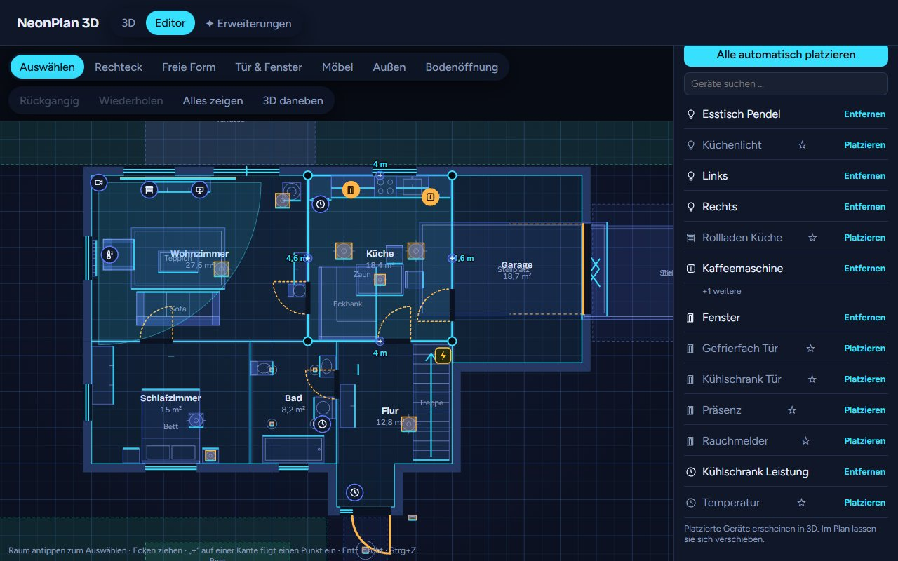

A room with an area lists all devices of that area on the right, grouped by device. The main entity comes first, further ones such as LED indicators or effects sit behind **"+n more"**. A search field helps with big areas.

- **Place** puts a device into the room, **Place all automatically** places all main devices.
- Lights are placed as lamps from the library, so they glow in 3D.
- **☆** adds a device to the room panel of the 3D view without placing it.
- Drag a placed device to its spot in the plan.

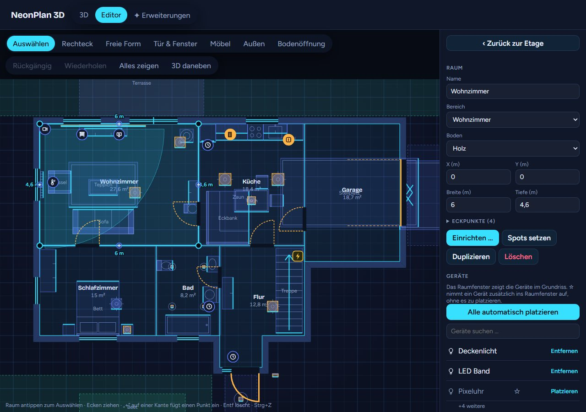

A selected device has:

- **Marker height**, **rotation** and, for lights, the **mount**: ceiling, floor, table or wall.
- **Ask before switching:** A tap in 3D, the quick menu and the room panel ask first. This protects, for example, a server switch from an accidental tap. A double tap on the room leaves this device out.
- **To room centre** and **Remove**.

### 4.11 Lamps

Lamps are furniture with a linked light: ceiling light, downlight, surface spot, LED panel, pendant, floor lamp, uplight, table lamp, wall light, LED strip, path light and garden spot.

- The 3D model glows in the light's colour and brightness. The room's floor and walls are lit too, two coloured ceiling lights mix in between. Light reaches the next room only through doors.
- Colour effects such as a colour loop are animated in 3D.
- Table lamps stand on the item below, wall lights and LED strips snap to the wall, a pendant's height is how far it hangs below the ceiling.
- **Height above floor:** wall lights hang at 1.75 m by default, LED strips right under the ceiling. In the form you set a **Height above floor** of their own, e.g. for a strip under the wall cabinets or behind the TV unit. **Automatic height** resets it. A strip below 1 m (skirting board, behind a cabinet) shines up the wall, higher strips shine down. A strip below the cut height stays visible with cut walls.
- A switch works instead of a light too, e.g. a relay for the ceiling light.
- Several lamps may follow the same light.

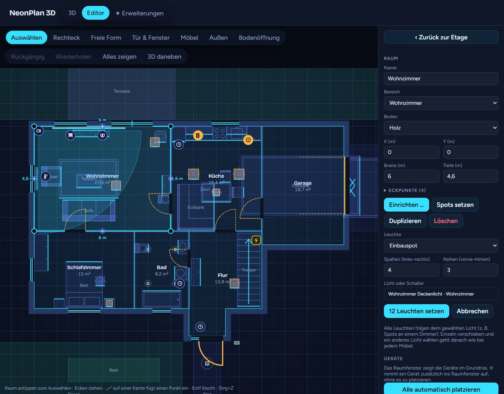

**Place spots** on a room lays out a grid of lamps that all follow one light, e.g. six downlights on one dimmer. Choose columns and rows first.

### 4.12 Electric furniture

TVs, media walls, desks with monitors, washing machines, dryers, dishwashers, radiators, robot vacuums and many pack items link to entities:

- **Device** or **TV (media player)**: A TV glows while it is on. Washing machine, dryer and dishwasher glow while they run. A radiator with a thermostat glows while it heats.
- **Power sensor (W)**: The item shows its watts.
- **Ask before switching** as with devices.
- **Pictures by state** on screens: a Pro add-on, see [6.3](#63-live-screens).

"Automatic" means NeonPlan 3D finds the matching entity in the area by itself.

### 4.13 Cameras

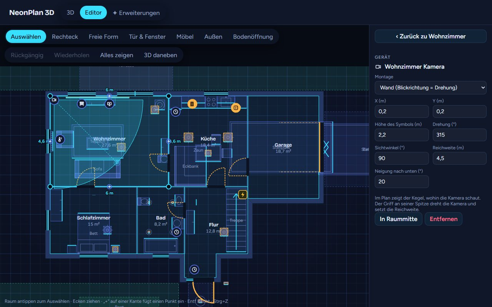

Place cameras like any device. Then:

- **Mount:** wall, looking along its rotation, or ceiling as a dome that sees all round.
- In the plan a **wedge** shows where the camera looks. The **handle at its tip** turns the camera and sets its reach at the same time.
- **Field of view (°)**, **Reach (m)** and **Tilt down (°)** can be typed in as numbers.

In 3D the camera hangs as a small model on the wall or ceiling, its field of view lies on the floor as a wedge. When a motion or presence sensor of the camera reports motion, the wedge turns red.

### 4.14 Parking spots and vehicles

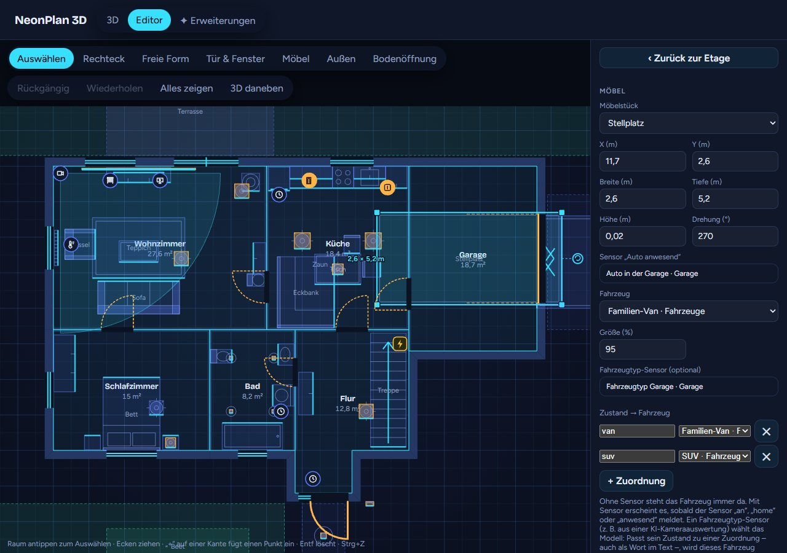

The item **Parking spot** in the Parking group marks where a car stands: in the garage, on the driveway or anywhere on the plot.

- **Sensor "car present":** a `binary_sensor`, `device_tracker` or similar. While it reports a car, the vehicle is there.
- **Vehicle:** the model from the "Vehicles" pack.
- **Vehicle type sensor** (optional): If a sensor reports which car is there, e.g. from an AI camera analysis, assign a model to each state.
- **Size (%)** fits the model to the spot. If the vehicle is taller than the room, the editor warns.

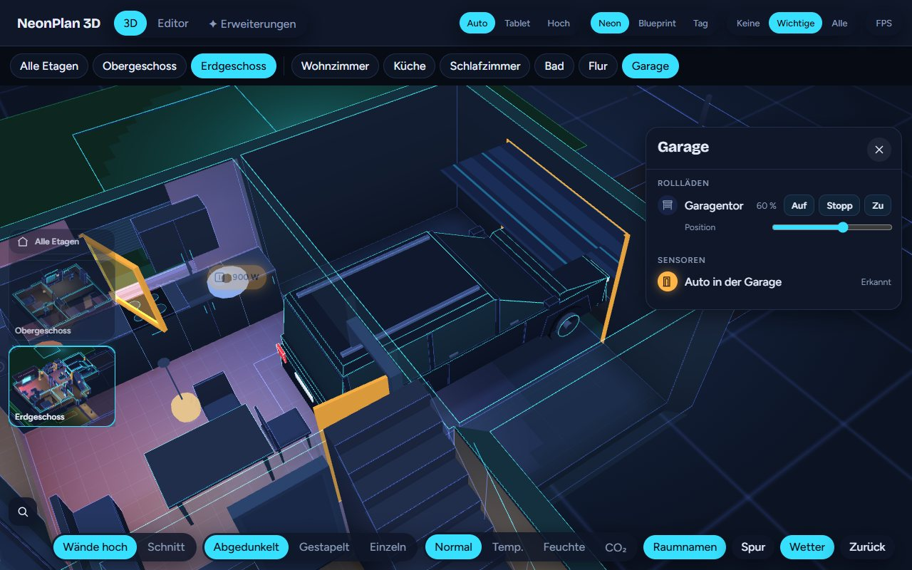

### 4.15 Robot vacuum

The robot vacuum item links to the `vacuum` entity. While the robot cleans, it drives lanes through the room of its dock in 3D and then returns. The lanes are simulated because Home Assistant usually does not know the real position.

### 4.16 Stairs and floor openings

- The **Stairs** from the library rise from the marked front edge towards the back. If they reach the floor above, they cut the stairwell into its floor.
- The **Floor opening** tool draws a hole straight into a floor, e.g. above the staircase or for a gallery. From above you look through it. The opening must lie within one room.
- More stairs and railings come with the **Stairs & railings** pack.

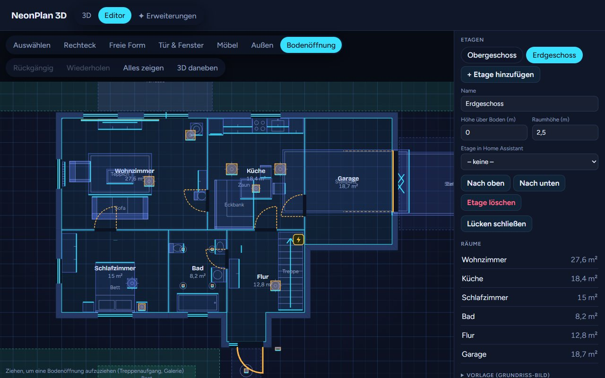

### 4.17 Outdoor areas and outdoor lights

With **Outdoor** you draw lawn, terrace, path, driveway, pool, flower bed, hedge or fence. Path lights, garden spots and outdoor wall lights light the outdoor areas and the facade.

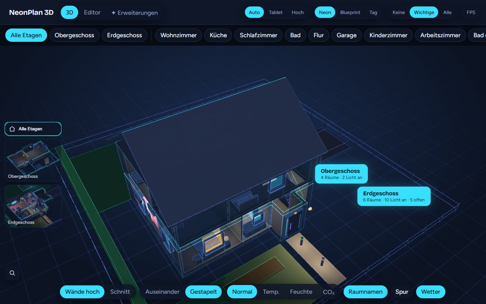

### 4.18 3D beside

**3D beside** shows the 3D view to the right of the plan. Every change appears there a moment later.

- Drag the **divider between plan and 3D** to change the ratio. The browser remembers it.
- At the top of the 3D half you switch between **Tall walls** and **Cut**.
- You can also tap and drag an item or device in the 3D half. A bar with width, depth, height, height above the floor, rotation and delete appears at the bottom.
- The sidebar folds away beside the 3D view. Small buttons at the right edge open it again, the pin keeps it open.

---

## 5. The 3D view

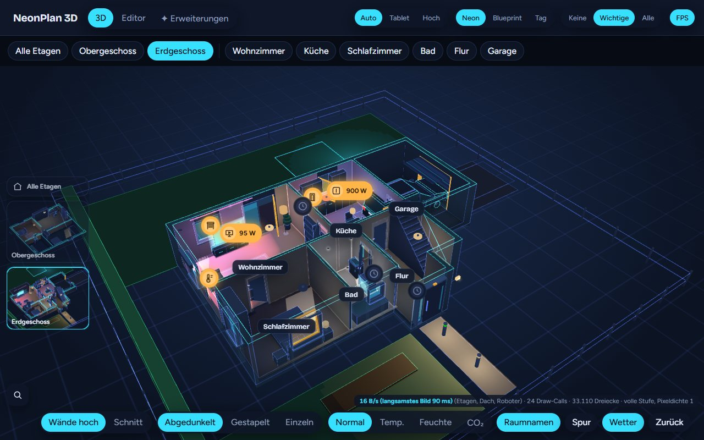

### 5.1 House, floor, room

The 3D view has three levels:

1. **The whole house** with a label per floor: rooms, lights on, open windows.
2. **One floor:** The floors above fly away, the ones below stay dimmed, stacked or hidden, as you choose.
3. **One room:** The camera flies in, the room panel opens.

**Navigating:**

- Tap a floor label or a room to go one level down.
- **Double tap** an empty spot, **Esc** or **Back** go one level up.
- Drag to turn the view, two fingers or the mouse wheel zoom.
- The **floor pictures** on the left jump straight to a floor.
- Buttons at the top list all floors and the rooms of the open floor.

### 5.2 The switches at the bottom

| Switch | Effect |
|---|---|
| **Tall walls** / **Cut** | Walls at full height, the front ones as tinted glass, or all walls cut at hip height |
| **Apart** / **Stacked** | In the house view: floors pulled apart or on top of each other |
| **Dimmed** / **Stacked** / **Alone** | With an open floor: what happens to the floors below |
| **Normal** / **Temp.** / **Humidity** / **CO₂** | Heatmap: floors coloured by the room's value |
| **Room names** | Show or hide the room names |
| **Trail** | Motion trail, Pro, see [6.1](#61-camera-cockpit) |
| **Weather** | Weather outside, Pro, see [6.2](#62-weather-outside) |

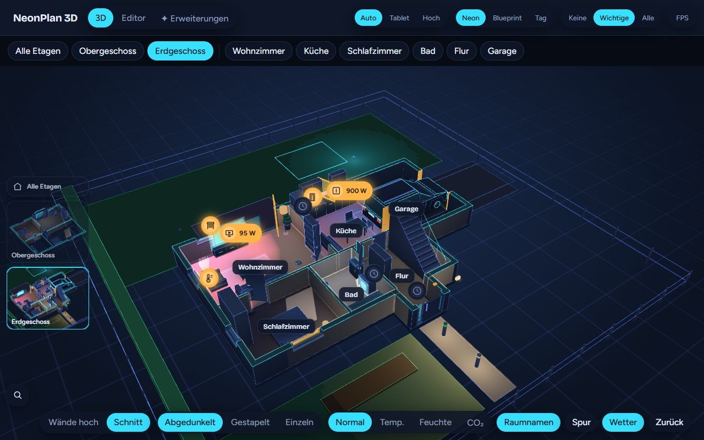

At the top right:

| Switch | Effect |
|---|---|
| **Auto** / **Tablet** / **High** | Quality level. Tablet leaves out patterns, shadows and halos and is chosen automatically on Fire tablets. High adds light cones under spots |
| **Neon** / **Blueprint** / **Day** | The look |
| **None** / **Important** / **All** | Which device markers appear. Important shows only devices without their own 3D model and values such as watts or the running app |
| **FPS** | Frame rate, slowest frame and the reason for every drawn frame. At rest it reads 0 fps |

Each device remembers these switches.

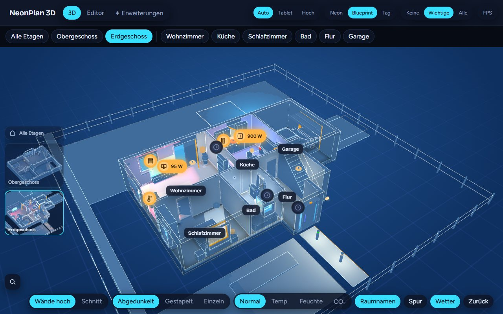

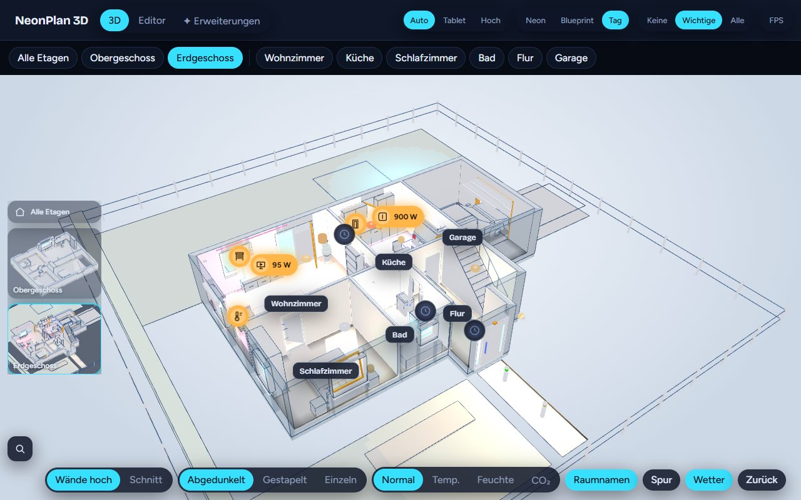

### 5.3 Controlling

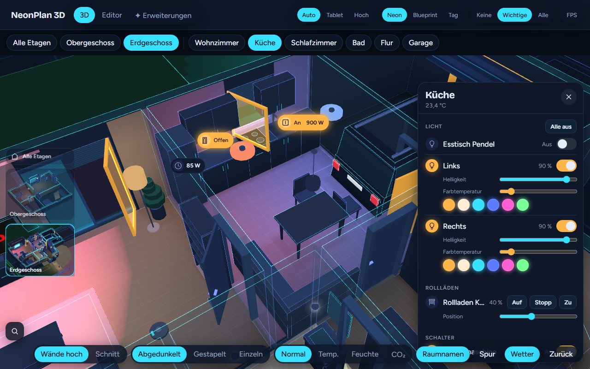

- **Tap** switches lamps and switches. The lamp flashes briefly to confirm.
- **Swipe up or down** on a lamp dims it; on a blind or window it moves the blind. The value appears at your finger.
- **Long press** opens the quick menu: brightness, colour temperature and colours for lights; up, stop, down and fixed positions for blinds.
- Tap a **window** – frame, glass or blind – to open the blind menu or show the contact.
- **Double tap a room** switches all its lights on or off. Devices with "Ask before switching" stay out.
- TVs, doors and garage doors can be tapped directly as well.

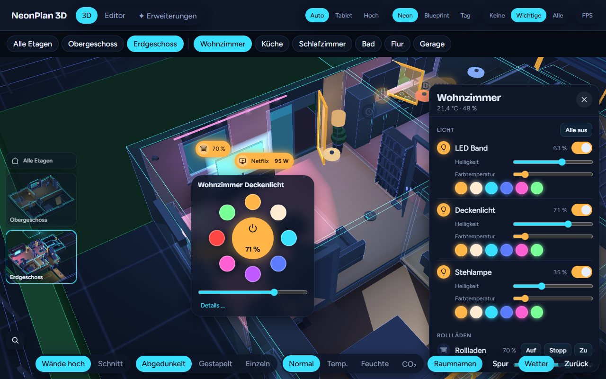

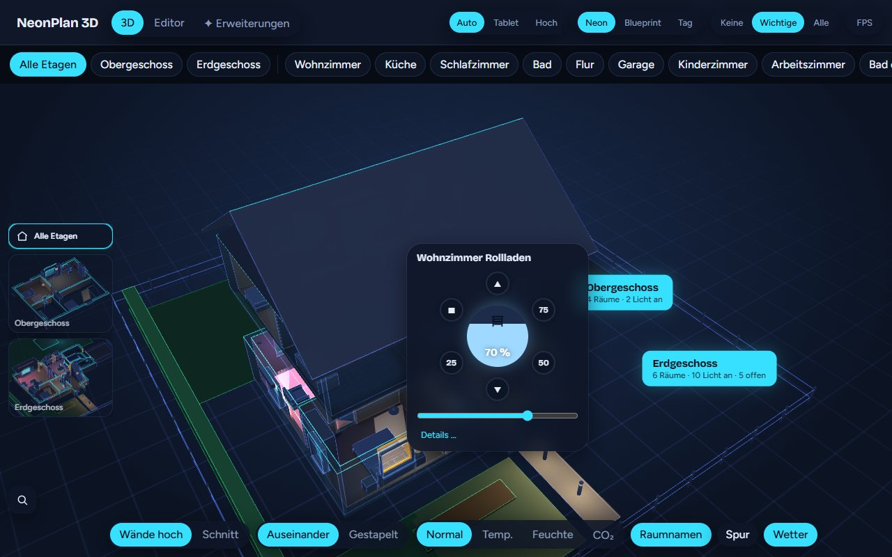


### 5.4 The room panel


In a room the room panel opens on the right, at the bottom on phones and portrait tablets. It shows the room's devices by kind: lights with brightness, colour temperature and colours, **All off**, covers, heating, media, switches, cameras with snapshot, sensors, and scenes & scripts.

It shows the devices placed in the room and everything you added with ☆ in the editor. **More devices of the area** shows the rest.

With a selected room and no open room panel, the area's **scenes and scripts** appear as buttons at the bottom.

### 5.5 Search

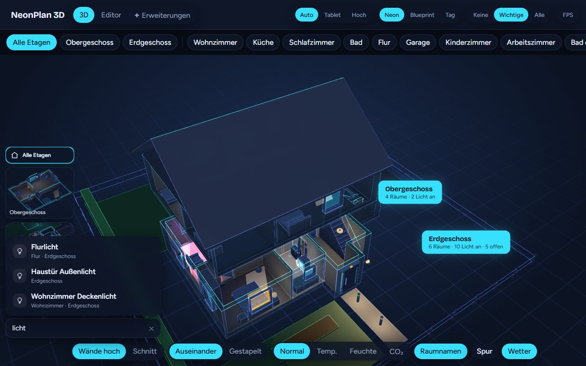

The magnifier at the bottom left opens **"Where is …?"**. Type a device or room name. A hit flies the camera there and the device flashes.

### 5.6 Heatmap

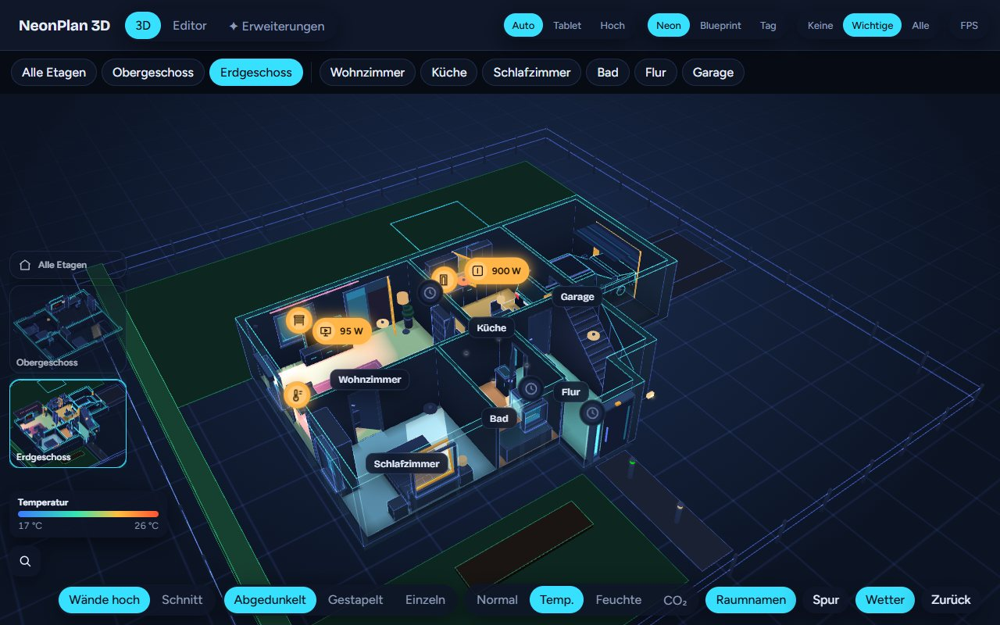

**Temp.**, **Humidity** and **CO₂** colour the floors by the area's sensors, with a colour scale at the edge.

### 5.7 Sun and daylight

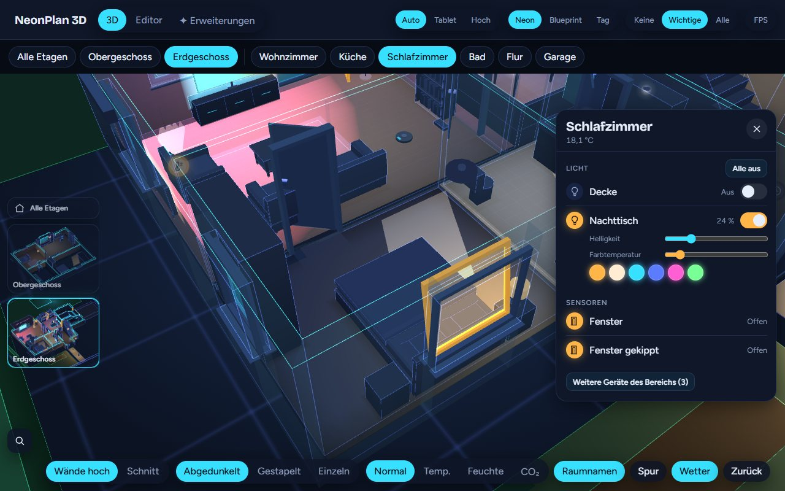

With north set, sunlight from `sun.sun` falls through the windows facing the sun as soft patches on the floor. Lowered blinds make the patches smaller. By day the sky behind the house gets lighter.

### 5.8 Warnings


NeonPlan 3D warns for free and without setup:

| Warning | Trigger |
|---|---|
| Smoke, gas, carbon monoxide, water | A `binary_sensor` of that device class in the area reports on |
| Alarm | An `alarm_control_panel` is triggered or about to trigger |
| Window open in the rain | A window is open or tilted while the weather entity reports rain, lightning rain, hail or sleet |

The room pulses red and a banner appears at the top. A tap on the warning jumps into the room.

### 5.9 Cameras in 3D


A tap on the camera or on its wedge opens the snapshot, which refreshes every few seconds. A tap on the picture opens the Home Assistant live view. The wedge is a much bigger target than the small camera.

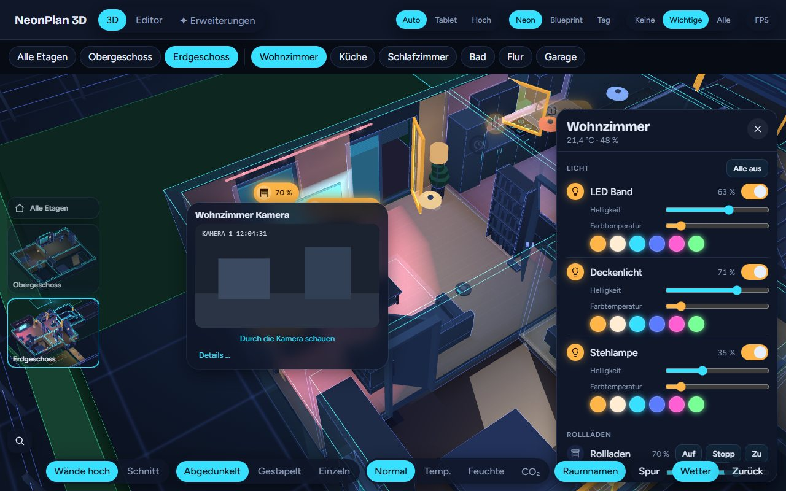

---

## 6. Pro add-ons

Pro add-ons are paid extra features, sold singly in the shop. Without an add-on, the switches show a 🔒 and a hint leads to the shop. How to install them is in [chapter 7](#7-extensions-shop-and-furniture-packs).

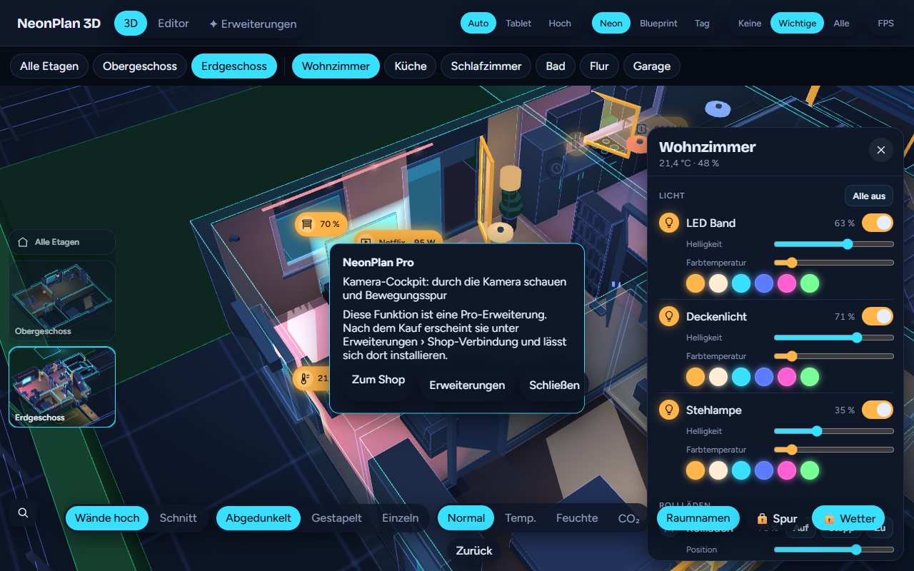

### 6.1 Camera cockpit

**Look through the camera:** The snapshot menu of a camera and the room panel offer "Look through the camera". The 3D view flies to the camera's spot and looks along its direction, with the live picture blended over the scene. The slider at the bottom sets the blend, "Back to the view" flies back. If the picture does not line up, correct the camera's rotation and tilt in the editor.

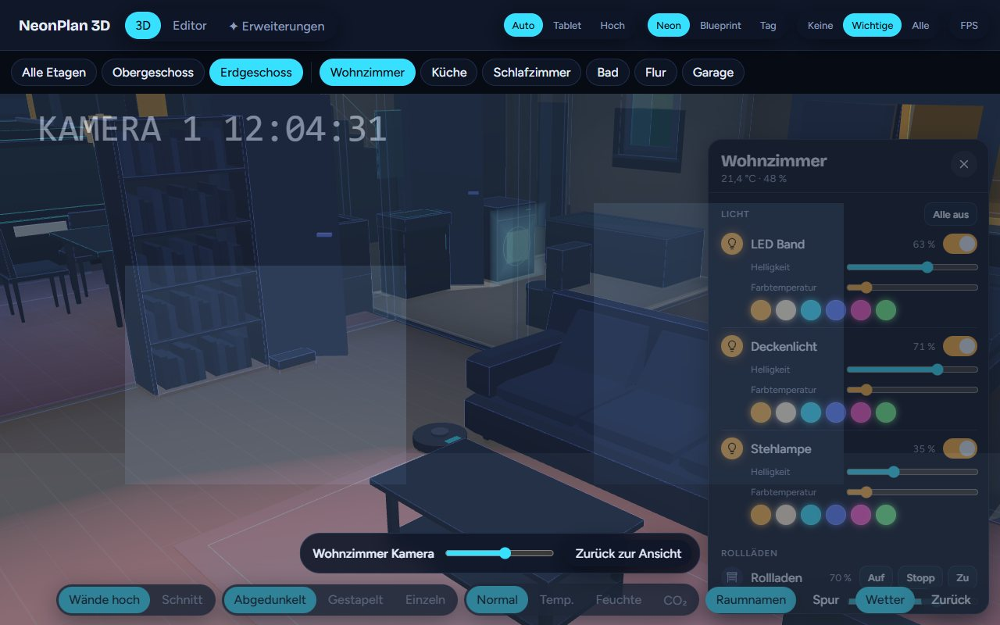

**Motion trail:** The **Trail** switch shows where motion was reported in the last 30 minutes: glowing spots with the time, joined in order, older ones fading. Sources are motion, presence and occupancy sensors. Sensors placed in the plan sit at their spot, camera sensors at the camera, all others in the middle of their room. The data comes from Home Assistant's history and reloads every minute.

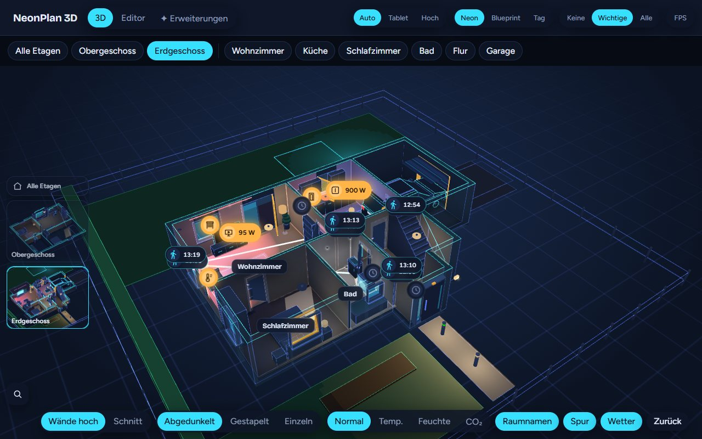

### 6.2 Weather outside

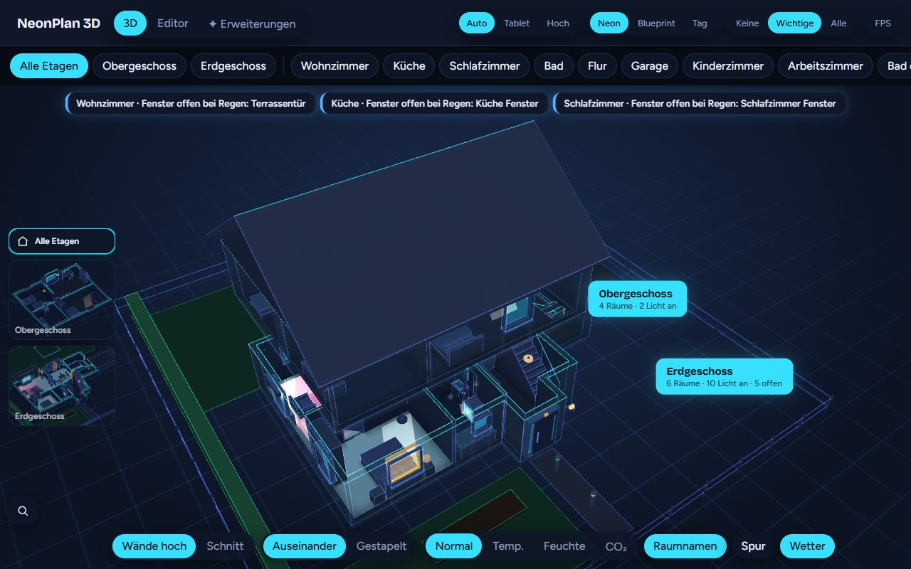

The weather around the house follows your weather entity:

| State | In 3D |
|---|---|
| rainy, pouring, hail | Rain, with clouds |
| snowy, snowy-rainy | Snow, both for sleet |
| lightning, lightning-rainy | Lightning, with rain for the second |
| fog | Fog, only if switched on |
| cloudy, partlycloudy | Clouds dim the sky and the sunlight |
| windy | Wind drives rain and snow at an angle |
| sunny, clear-night | Sun by day, moon by night |

If the entity provides `cloud_coverage` and `wind_speed`, NeonPlan 3D uses them.

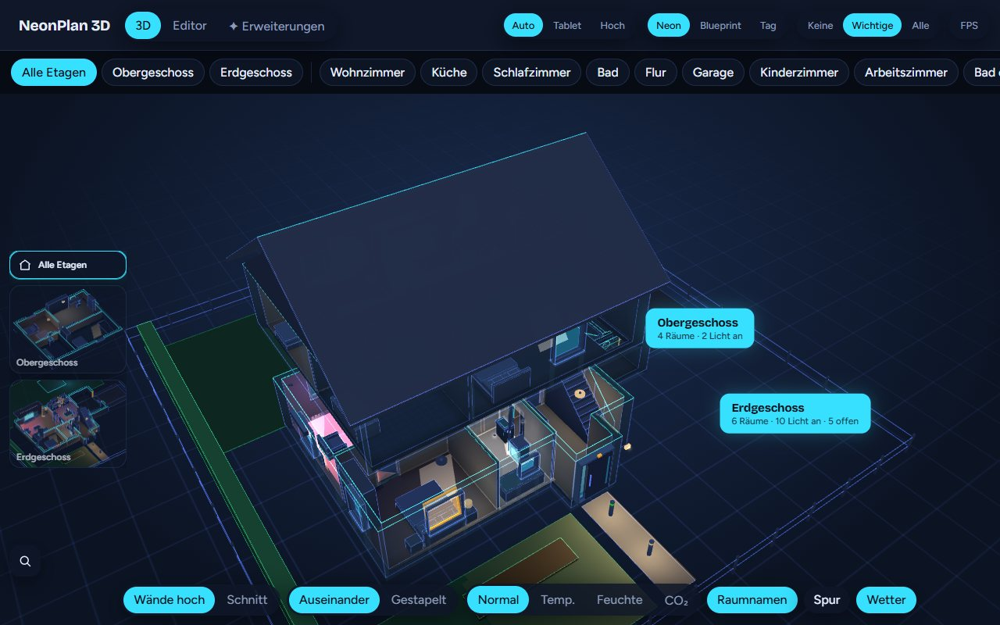

**Settings** in the editor: **Weather entity** picks the entity, **Weather effects in 3D** switches single effects off. Fog starts off because it greys the whole scene. At the Tablet quality level only the dimming by clouds remains.

### 6.3 Live screens

Without this add-on a TV only glows while it is on. With it:

- TVs and monitors show the **colour of the running app** and the media player's **artwork**.
- **Pictures by state:** Add rules to a screen item. When an entity is in a certain state or an attribute has a value, the screen shows a picture. Example: the TV's attribute `app_name` contains "netflix", so the Netflix logo appears. A value matches when it is equal or contained in the text, `*` always matches. The first matching rule wins.
- A picture can be an upload, scaled to 512 pixels, a picture URL or a **camera**. A camera picture refreshes every 5 seconds while it is visible.
- **Screen behind the picture:** dark or white, depending on whether the logo is light or dark.
- "✓ matches now" on a rule shows which picture is visible right now. Uploaded pictures can be reused on other screens.

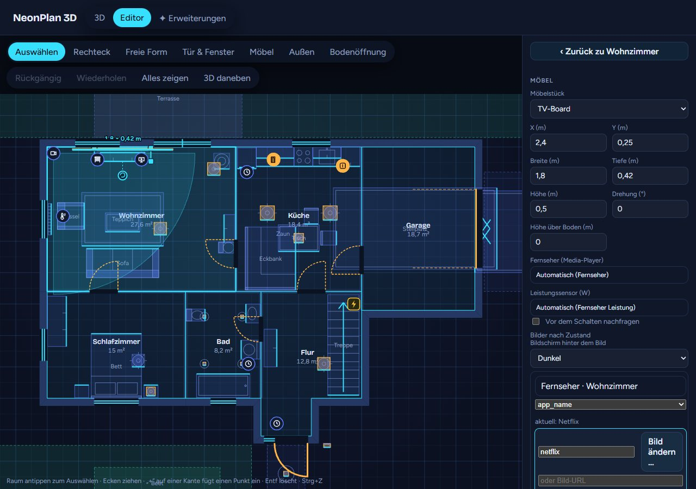

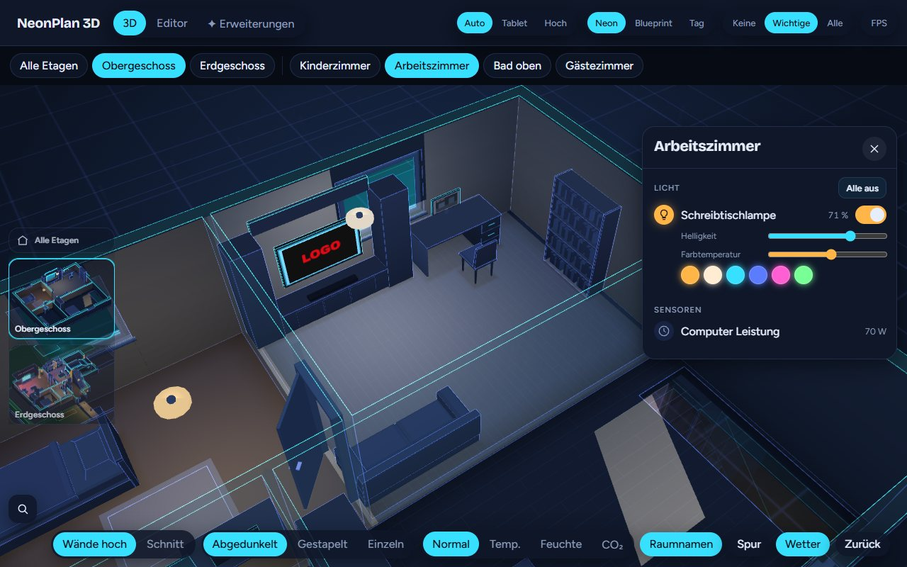

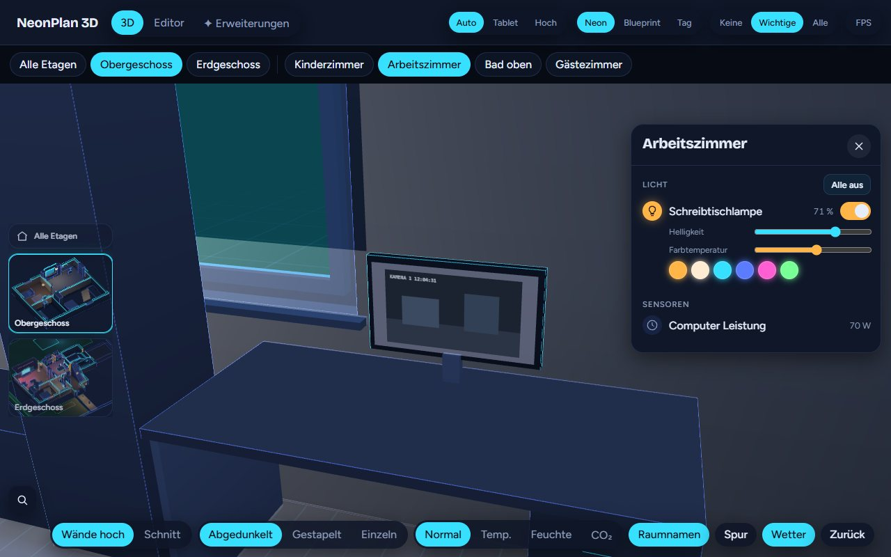

---

## 7. Extensions, shop and furniture packs

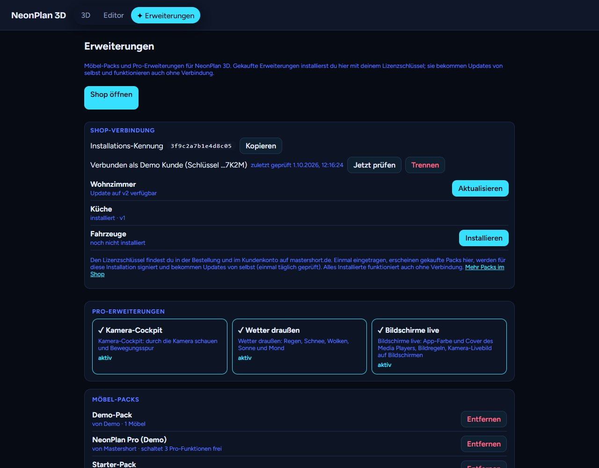

The **✦ Extensions** tab gathers everything you can add to NeonPlan 3D.

### 7.1 Shop connection

With your first purchase at mastershort.de you get a **licence key** in the form `NP-XXXX-XXXX-XXXX-XXXX`. It is in the order e-mail and in your customer account.

1. Open **Extensions**.
2. Enter the key under **Shop connection** and press **Activate**.
3. Your purchases appear with **Install**. A tap fetches the pack from the shop, signed for exactly this installation.

After that:

- **Updates come by themselves.** Once a day NeonPlan 3D asks whether there are new purchases or newer versions and installs them. **Check now** asks right away.
- **Everything keeps working offline.** Installed packs are checked locally, the shop is never needed for that.
- **Disconnect** removes the key. Installed packs stay.

**Several installations:** A key is connected to at most three installations at a time. If you move to new hardware, simply connect the new installation, the oldest one then drops out. Up to five new connections are possible per year. The **Installation id** at the top is an anonymous fingerprint of your installation.

### 7.2 Pro add-ons

The middle row of tiles shows the three Pro add-ons. Active ones carry a ✓, locked ones a 🔒 and the link "See in the shop".

### 7.3 Furniture packs

| Pack | Contents |
|---|---|
| Living room | Sofas, wall units, fireplaces, media furniture and more |
| Kitchen | Base units, tall units, islands, appliances |
| Bedroom | Beds, wardrobes, chests of drawers, nightstands |
| Bathroom | Washbasins, showers, bathtubs, WCs |
| Kids, Office & gaming, Garden & terrace, Garage & workshop, Fitness, Smart home & tech | Furniture and devices for each area |
| Vehicles | Cars, vans, motorbikes and more for parking spots |
| Stairs & railings | Straight, L- and U-shaped stairs, spiral stairs, space-saver stairs, outdoor steps, landing, railings in metal, glass and wood |

At the bottom of the page you find your installed packs with **Remove**. Below is **Import furniture packs …** for pack files: free sampler packs from the newsletter, downloads from the website or installations without internet. You can pick several files at once.

**Good to know:**

- Packs are digitally signed. Only packs from the publisher can be imported, changed files are refused.
- If you remove a pack, its furniture stays in the plan as plain boxes. Import it again and it is back, with all its links.
- A newer version of a pack replaces the old one without losing anything in the plan.

---

## 8. The dashboard card


The card `custom:neonplan3d-card` brings the 3D view into any dashboard. It loads automatically.

**Adding it:** Edit the dashboard, **Add card**, search for "NeonPlan". Set every option in the card's visual editor:

| Section | Options |
|---|---|
| **View** | One floor or the whole house, fixed size or full screen, height, look, walls, quality, floors below |
| **Show** | Markers, heatmap, switches in the card, floor pictures, room names, room panel, full-screen button, floors apart, performance display |
| **Features** | Warnings, jump to a warning, scene buttons, motion trail, weather with weather entity |
| **Wall tablet (kiosk)** | Back to the start view, night dimming, camera turn as screensaver |

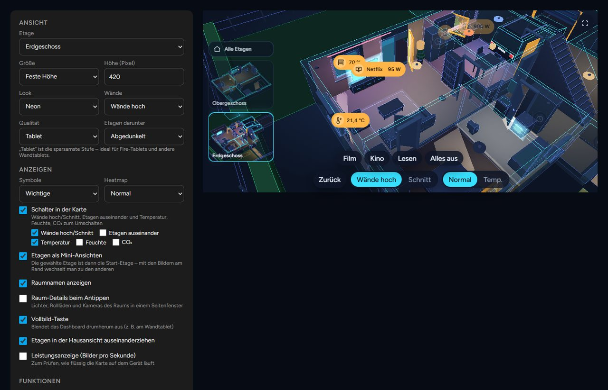

In YAML a card looks like this. Every line except the first is optional:

```yaml
type: custom:neonplan3d-card
floor: floor_ab12cd34   # show one floor (id from the editor)
height: 420             # height in pixels
fill: false             # fill the screen below the header
walls: auto             # auto | cut
explode: true           # pull floors apart in the house view
floor_stack: dim        # floors below: dim | stacked | single
quality: auto           # auto | low | high
theme: neon             # neon | blueprint | day
markers: important      # none | important | all
heatmap: none           # none | temperature | humidity | co2
room_panel: true        # tapping a room opens the room panel
room_names: true
controls: true          # switches in the card, or a list: walls, floors, temperature, humidity, co2
floor_thumbs: true
fullscreen_button: false
stats: false
alerts: true
alert_jump: false       # jump into the room of a new warning
scenes: true
motion_trail: false     # Pro: camera cockpit
weather: true           # Pro: weather outside
weather_entity: weather.home
idle_return: 0          # seconds without a touch until the start view
night: "off"            # off | sun | "22:00-06:00"
idle_orbit: false
```

---

## 9. NeonPlan 3D on a wall tablet

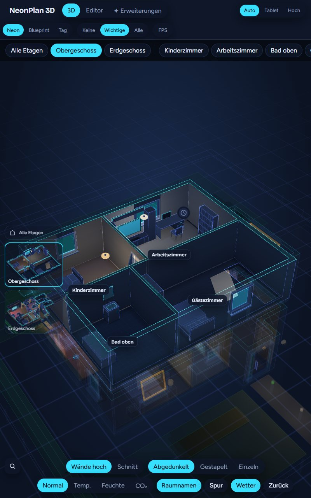

NeonPlan 3D is built for wall tablets such as the Amazon Fire:

- **No work while idle.** If nothing changes, the view draws not a single frame. The FPS display then reads "At rest (0 fps)".
- **Tablet quality level:** "Auto" picks it by itself on Fire tablets. Patterns, shadows, halos and particles are left out, animations run at half rate.
- **Kiosk options of the card:** After a few minutes without a touch the card returns to the start view. At night it dims by the sun or by the clock. As a screensaver the house turns slowly.
- **Warnings** can jump into the affected room by themselves.
- In portrait the room panel appears at the bottom.

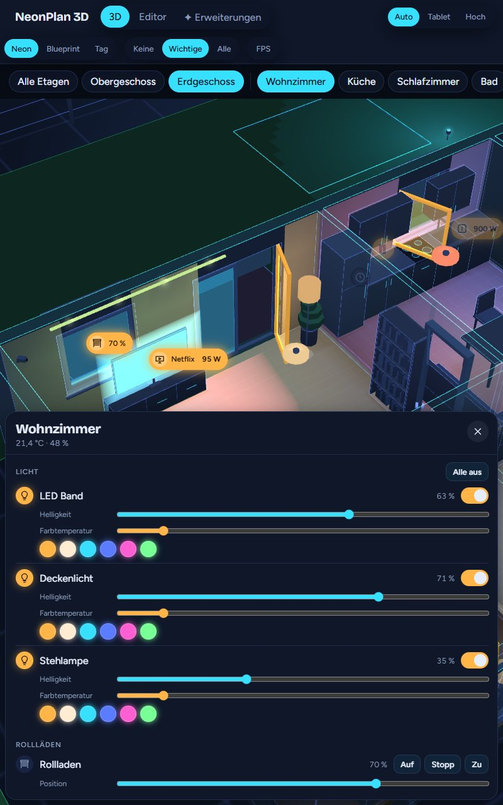

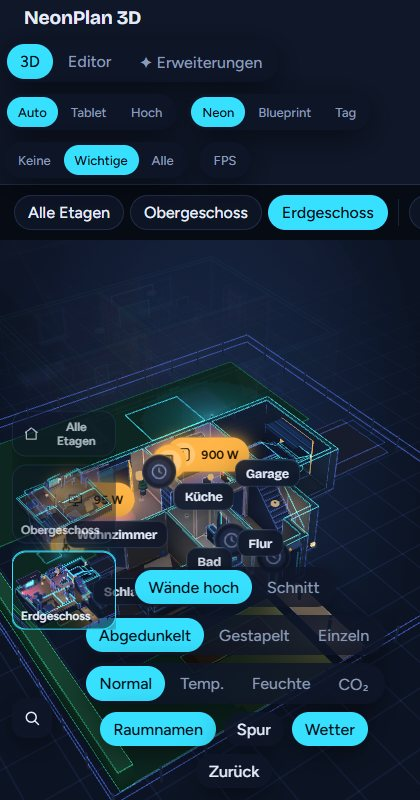

**Tips for Fire tablets:** Use Fully Kiosk Browser with hardware acceleration, show the card full screen with `fill: true` and keep `quality: auto`.

---

## 10. Backup and moving

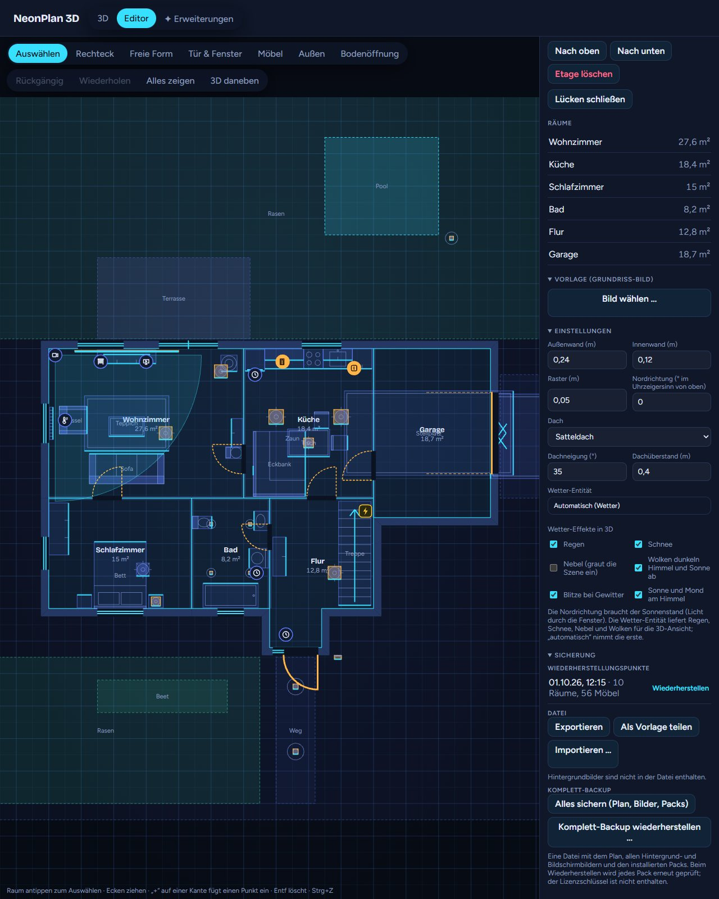

Under **Backup** in the editor:

- **Restore points** are kept at most every 10 minutes while you edit, the last 20 stay. **Restore** brings back a state, the current one is kept as a restore point itself.
- **Export** saves the plan as a file, **Import …** loads such a file.
- **Share as template** exports without areas, devices, sensors and pictures. Good for passing a floor plan on.
- **Full backup:** **Back up everything (plan, pictures, packs)** saves one file with the plan, every background and screen picture and the installed packs. **Restore a full backup …** brings it back into the same or another installation. Every pack is checked again. Packs signed for another installation are fetched there again through the shop connection. The licence key is not in the file.

Home Assistant's own backup includes NeonPlan 3D completely as well.

---

## 11. Data and privacy

- The plan, pictures and packs are stored in Home Assistant under `.storage`. None of it leaves your installation.
- NeonPlan 3D only connects to the internet if you enter a licence key. Then it asks mastershort.de once a day for updates and sends the key and the anonymous installation id.
- Camera pictures, history and states stay in Home Assistant and are only shown in the browser.

---

## 12. FAQ and troubleshooting

**"Restart needed" appears at the top.**
After an update the old version still runs in the background. Restart Home Assistant.

**A device is missing in a room's device list.**
The room needs an area, and the device must belong to that area, either the device or the entity itself. If the entity sits under a device with several entities, it is behind "+n more". The search field finds it directly.

**A camera is hard to hit.**
Tap its wedge on the floor, it counts like the camera.

**Furniture shows as grey boxes.**
The pack it comes from is not installed. Import it again or install it through the shop connection.

**Dragging in 3D, an item does not pass through the wall.**
That is on purpose: in the 3D view furniture and devices stay in their room while dragged and slide along the wall. Move them into another room in the floor plan, where they move freely.

**A tap hits the device in the next room.**
Walls catch taps. In the room view only things in the room count. If it still hits the wrong thing, the **Cut** switch helps.

**The view stutters on the tablet.**
Set quality to **Tablet** and check with **FPS** what is drawing. At rest it should read 0 fps. If something keeps running, the reason is shown next to it, e.g. a lamp's colour effect.

**Sunlight falls through the wrong windows.**
Check **North** under Settings: degrees clockwise from "up" in the plan.

**The shop connection reports "limit reached".**
The key was connected to more than five new installations in the last twelve months. Contact us, we will help.

**The shop cannot be reached.**
Installed packs and Pro add-ons keep working. Updates arrive as soon as the shop answers again.

**Where do I report bugs?**
In the issue tracker on GitHub: https://github.com/Mastershort/neonplan3d/issues
